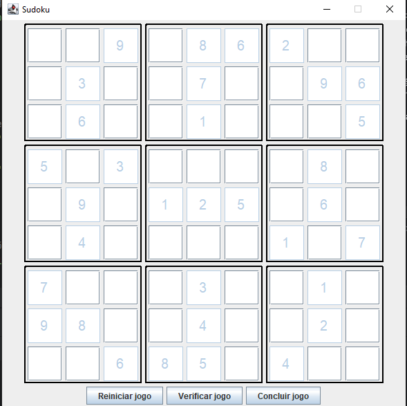

# Jogo de Sudoku em Java


## 📖 Sobre o Projeto

Este projeto é uma implementação completa de um jogo de Sudoku, desenvolvido como parte de um desafio de código do **Santander Bootcamp em Java**, oferecido pela Digital Innovation One (DIO).

O objetivo inicial era aplicar e aprofundar os conhecimentos em **Coleções e Streams em Java**. No entanto, o projeto evoluiu para um estudo pessoal mais aprofundado, servindo como meu primeiro contato prático com as tecnologias de interface gráfica **Swing** (uma abordagem mais tradicional) e **JavaFX** (a estrutura moderna para aplicações de desktop em Java).

O resultado é uma aplicação robusta que separa claramente a lógica do jogo da sua apresentação, permitindo que o mesmo "cérebro" do Sudoku seja executado de três formas diferentes: via terminal, com uma interface Swing e com uma interface moderna em JavaFX.

## ✨ Funcionalidades

*   **Tabuleiro Interativo:** Jogue em um tabuleiro 9x9 com regras clássicas de Sudoku.
*   **Números Fixos:** O puzzle inicial é carregado com números fixos que não podem ser alterados.
*   **Validação em Tempo Real:** A lógica de validação está pronta para verificar erros e o estado do jogo.
*   **Controles do Jogo:**
    *   **Verificar Status:** Informa se o jogo está incompleto ou completo, e se contém erros.
    *   **Reiniciar:** Limpa todas as jogadas do usuário, restaurando o puzzle inicial.
    *   **Finalizar Jogo:** Verifica se o jogo foi concluído com sucesso e exibe uma mensagem de parabéns.

## 📸 Capturas de Tela

### Interface JavaFX (Recomendada)



### Interface Swing (Legado)


## 🛠️ Tecnologias Utilizadas

*   **Java 22:** Versão mais recente da linguagem, utilizando recursos modernos.
*   **Maven:** Gerenciador de dependências e build do projeto.
*   **JavaFX:** Framework moderno para a criação da interface gráfica principal.
*   **Swing:** Framework legado para a criação de uma interface gráfica alternativa.
*   **Lombok:** Biblioteca para reduzir código boilerplate (como getters, setters, etc.).
*   **JUnit 5:** Para futuros testes unitários.

## 🚀 Como Executar

Para executar este projeto, você precisará ter o **JDK 22** e o **Maven** instalados em sua máquina.

1.  **Clone o repositório:**

  ``` Shell Scriptgit
  clone https://github.com/SEU_USUARIO/SEU_REPOSITORIO.git
  cd SEU_REPOSITORIO2.Execute a versão desejada:
  ```

  ### 2. Execute a versão desejada:


  ## 1. Interface Gráfica com JavaFX (Recomendado)Esta é a versão principal e mais completa.

  Pode ser executada de duas formas:

  - Via Maven (terminal):
    ``` Shell Scriptmvn
    clean javafx:run
    ```

  - Pela IDE (IntelliJ, Eclipse, etc.): Execute o método main da classe br.com.dio.sudoku.SudokuApplication.

## 2. Interface Gráfica com Swing (Legado)

  Esta versão utiliza a biblioteca gráfica mais antiga do Java.

  - Pela IDE: Execute o método main da classe br.com.dio.sudoku.UIMain.

## 3. Via Linha de Comando (Sem GUI)

 Esta versão permite interagir com o jogo diretamente pelo terminal.

- Pela IDE: Execute o método main da classe br.com.dio.sudoku.Main.

## 🏗️ Estrutura do Projeto

O projeto segue uma arquitetura que separa as responsabilidades, facilitando a manutenção e a evolução:
- src/main/java: Contém todo o código-fonte Java.
  - br.com.dio.sudoku.model: Classes que representam o estado do jogo (Board, Space).
  - br.com.dio.sudoku.service: Lógica de negócio e serviços (BoardService).
  - br.com.dio.sudoku.ui: Pacote contendo as classes da interface Swing.
  - br.com.dio.sudoku.SudokuApplication: Ponto de entrada e classes da interface JavaFX.
- src/main/resources: Contém os recursos da aplicação.
  - br/com/dio/sudoku/sudoku-view.fxml: Arquivo FXML que define a estrutura da interface JavaFX.
  - br/com/dio/sudoku/styles.css: Folha de estilos para a interface JavaFX.
- pom.xml: Arquivo de configuração do Maven, onde as dependências são gerenciadas.

## 👨‍💻 Autor
Desenvolvido por Vitor como parte de um desafio de código e estudo pessoal.

(LinkedIn)[https://www.linkedin.com/in/vitor-tavares-chaves-500967236/]
